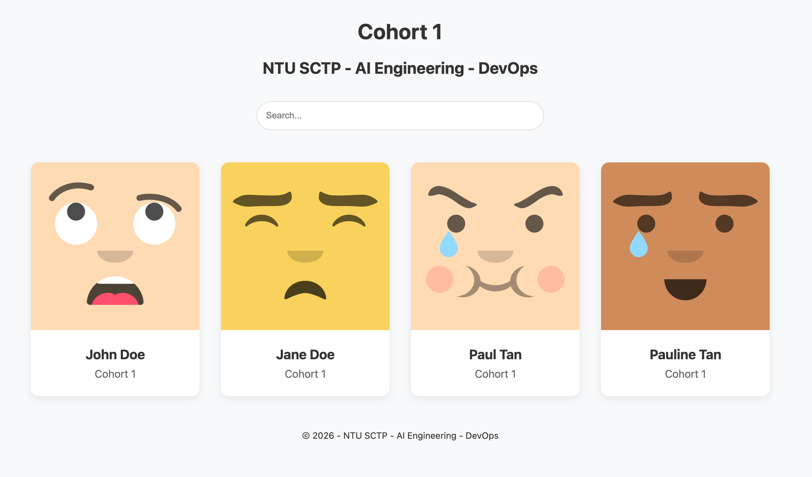
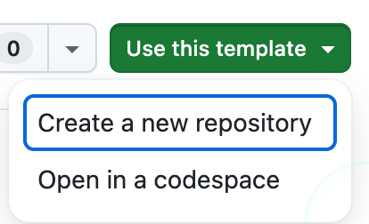
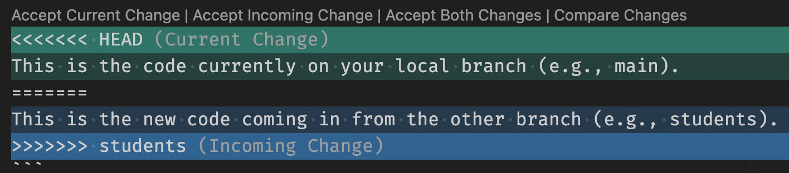

# Students



## Objectives

The objectives of this exercise is for you to learn:

- stage, commit, and push your changes to your `origin` remote repository,
- create a pull request to merge your changes to the upstream repository,
- how to fetch updates from the `upstream` remote repository, and
- how to resolve merge conflicts.

## Part 1: Add your changes

### Use this template



On the top right, click on the "use this template" button and select "create a new repository".

### Clone the repository

Now, clone your own copy to your local machine to make changes.

```sh
git clone https://github.com/<your-github-username>/students.git
```

### Switch to a new branch

You are currently in the `main` branch. You will need to create a new branch and switch to it.

```sh
git switch --create <my-new-branch>
```

In our case, we will create these two branches.

```sh
git checkout main
git switch --create feature-part-2
```

```sh
git checkout main
git switch --create feature-part-1
```

Continue working on the `feature-part-1`.

### Add your name and details

Edit the `students.json` file in the `data` folder and add your name and details.

```json
{
  "name": "Your Name",
  "cohort": 1,
  "photo": "https://api.dicebear.com/9.x/avataaars-neutral/svg?seed=Your-Name"
}
```

### Add an image to your profile card

If you have an image hosted on the web, you can add it to your profile card. Otherwise a default image will be used. You can also generate your own avatar with [DiceBear](https://www.dicebear.com/).

For instance, you can generate a random avatar based on your name [https://api.dicebear.com/9.x/avataaars-neutral/svg?seed=Your+Name](https://api.dicebear.com/9.x/avataaars-neutral/svg?seed=Your+Name)

### Run the web server locally

We want to check to see if the changes we have made work locally before pushing them to the remote repository.

Use a port number like `8080`.

```sh
python3 -m http.server [port]
```

### Stage, commit, and push

Stage, commit, and push your changes to your remote repository on GitHub.

```sh
git add students.json
git commit -m "Add my name to student directory"
git push origin <my-new-branch>
```

### Create a pull request

Create a pull request on GitHub to merge your changes to your `main` branch.

Learn more about [creating pull requests](https://docs.github.com/en/pull-requests/collaborating-with-pull-requests/proposing-changes-to-your-work-with-pull-requests/creating-a-pull-request).

## Part 2: Resolve merge conflicts

Notice that there were no conflicts in the previous part of the exercise. We will now create a merge conflict and try to resolve it.

### Switch to the `feature-part-2` branch

Recall that we had created another branch called `feature-part-2`. Now let's switch to that branch.

```sh
git switch feature-part-2
```

### Make some additional changes

Add a dummy name in the `students.json` file. You can add any name, except your own name.

### Make a pull request

Return to GitHub and try to make a pull request.

## Resolve merge conflicts

At this point, you may see merge conflicts. Go to the `students.json` file to fix those conflicts. A big part of collaborating with others in a team is resolving merge conflicts. This happens when one or more people are editing the same file. In this case, we will all be editing the `students.json` file.

```txt
<<<<<<< HEAD
This is the code currently on your local branch (e.g., main).
=======
This is the new code coming in from the other branch (e.g., students).
>>>>>>> students
```

In VS Code, we can click on the four options:

- `Accept Current Change` - this will keep your changes only
- `Accept Incoming Change` - this will keep their changes only
- `Accept Both Changes` - this will keep both yours and their changes
- `Compare Changes` - open a diff tool to compare changes

You must delete the `<<<<<<<`, `=======`, and `>>>>>>>` lines before saving.


